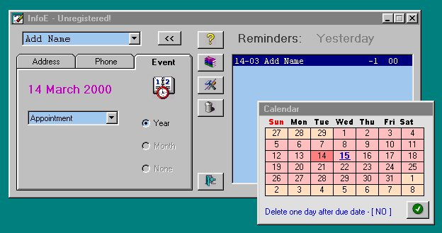



## TBook

### Description

A simple database type program with a reminder,phone book,address book and E-Mail entry.

Nice calendar routine and easy to use.
 
### More Info
 
Reminders of birthdays or any other date that you need to remember.Keep track of phone numbers, address and emails.

             |
---                |---
**Submitted On**   |2000-03-15 20:27:20
**By**             |[WayneL](https://github.com/Planet-Source-Code/PSCIndex/blob/master/ByAuthor/waynel.md)
**Level**          |Intermediate
**User Rating**    |3.4 (17 globes from 5 users)
**Compatibility**  |VB 5\.0, VB 6\.0
**Category**       |[Math/ Dates](https://github.com/Planet-Source-Code/PSCIndex/blob/master/ByCategory/math-dates__1-37.md)
**World**          |[Visual Basic](https://github.com/Planet-Source-Code/PSCIndex/blob/master/ByWorld/visual-basic.md)
**Archive File**   |[CODE\_UPLOAD40173162000\.zip](https://github.com/Planet-Source-Code/waynel-tbook__1-6632/archive/master.zip)

